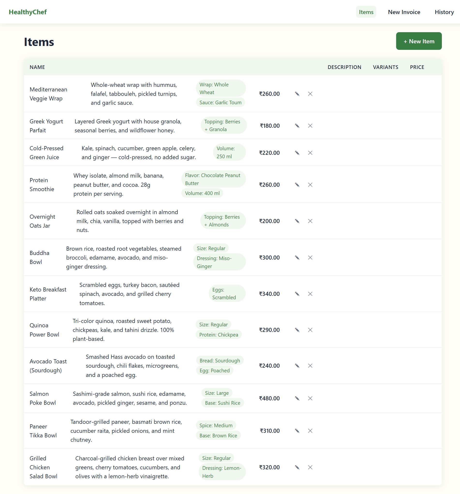
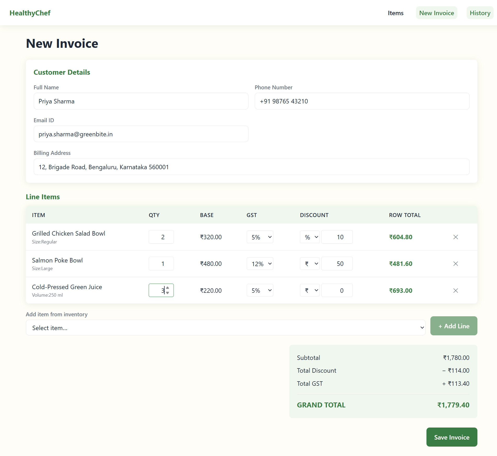
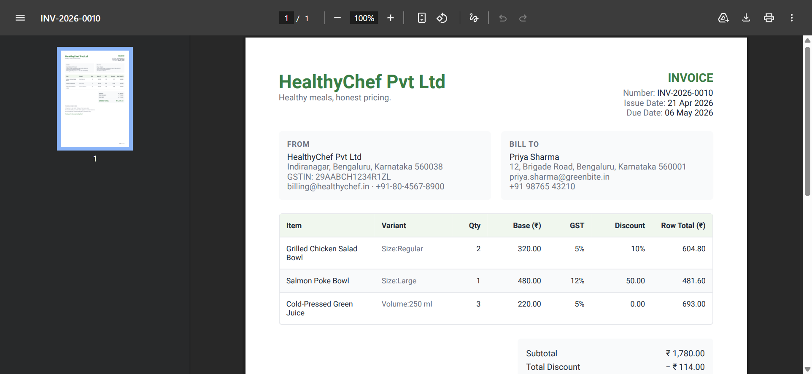
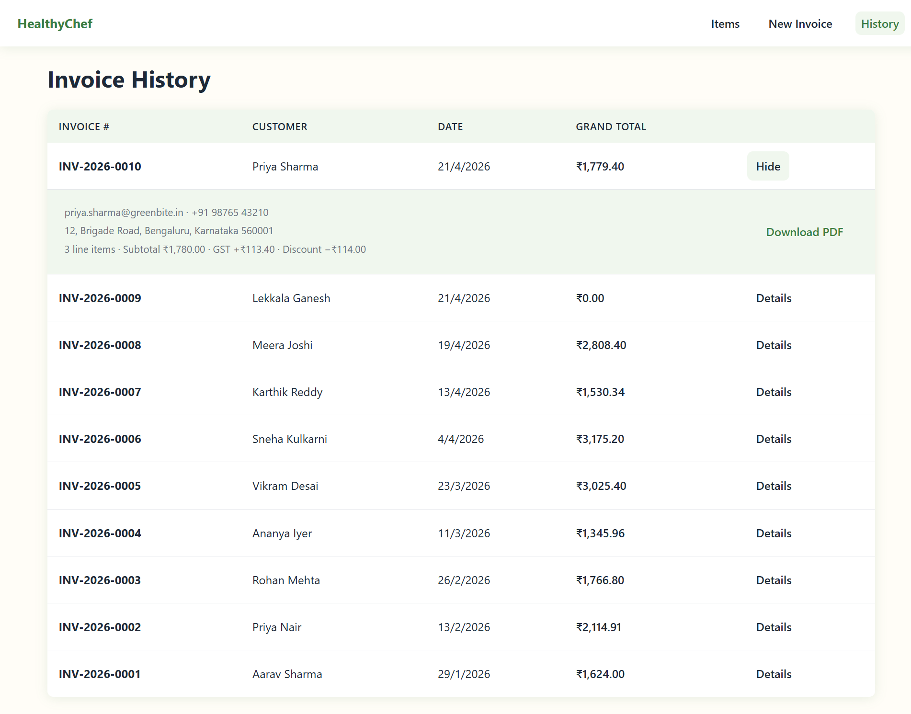

<div align="center">

# HealthyChef — Invoice Generator

A production-grade MERN invoicing application. Manage items, build invoices with live GST & discount math, persist to MongoDB, and download pixel-perfect PDFs.

[](https://nodejs.org)
[](https://www.typescriptlang.org)
[](#license)
[](https://conventionalcommits.org)

</div>

---

## Table of Contents

- [Overview](#overview)
- [Screenshots](#screenshots)
- [Features](#features)
- [Tech Stack](#tech-stack)
- [Prerequisites](#prerequisites)
- [Quickstart](#quickstart)
- [Environment Variables](#environment-variables)
- [Scripts](#scripts)
- [API Reference](#api-reference)
- [Architecture](#architecture)
- [Invoice Math](#invoice-math)
- [Project Structure](#project-structure)
- [Testing](#testing)
- [Design Decisions](#design-decisions)
- [Contributing](#contributing)
- [Out of Scope](#out-of-scope)
- [License](#license)

---

## Overview

HealthyChef is a full-stack invoicing tool built as a take-home assessment for the HealthyChef Full-Stack Developer role. It demonstrates a clean MVC backend, type-safe end-to-end flows, deterministic financial arithmetic, and a polished React front-end with client-side PDF generation.

The app covers the complete invoicing lifecycle:

1. **Items catalogue** — create, edit, and delete billable items with variants.
2. **Invoice builder** — customer capture, dynamic line items, live totals, and auto-generated invoice numbers.
3. **Persistence & export** — save to MongoDB Atlas and download a styled PDF with Indian GST terms.
4. **History dashboard** — browse previous invoices and re-download any PDF.

---

## Screenshots

> Drop PNG or JPG exports into [`docs/screenshots/`](docs/screenshots) using the filenames below and they will render here automatically.

<div align="center">

### Items Catalogue


### Invoice Builder


### Generated PDF


### History Dashboard


</div>

---

## Features

| #   | Module                                                    | Implementation                                                                                                                                               |
| --- | --------------------------------------------------------- | ------------------------------------------------------------------------------------------------------------------------------------------------------------ |
| 1   | Item CRUD with variants and base price                    | [`server/src/models/Item.ts`](server/src/models/Item.ts), [`client/src/pages/ItemsPage.tsx`](client/src/pages/ItemsPage.tsx)                                 |
| 2   | Invoice creation with customer details and auto-numbering | [`client/src/pages/NewInvoicePage.tsx`](client/src/pages/NewInvoicePage.tsx), [`server/src/services/invoiceNumber.ts`](server/src/services/invoiceNumber.ts) |
| 3   | Dynamic line items with live GST and discount math        | [`client/src/components/invoice/`](client/src/components/invoice), [`client/src/utils/invoiceMath.ts`](client/src/utils/invoiceMath.ts)                      |
| 4   | Persist to MongoDB and export PDF with Terms & Conditions | [`server/src/controllers/invoiceController.ts`](server/src/controllers/invoiceController.ts), [`client/src/components/pdf/`](client/src/components/pdf)      |
| 5   | History dashboard with expandable rows and re-download    | [`client/src/pages/HistoryPage.tsx`](client/src/pages/HistoryPage.tsx)                                                                                       |

---

## Tech Stack

**Frontend**
React 18 · TypeScript · Vite · styled-components · Framer Motion · TanStack Query v5 · Redux Toolkit · React Router v6 · Axios · @react-pdf/renderer

**Backend**
Node 20 · Express 4 · TypeScript (ESM) · Mongoose 8 · Zod · Helmet · CORS · express-rate-limit · express-mongo-sanitize

**Database**
MongoDB Atlas (free tier is sufficient)

**Testing**
Jest · ts-jest · Supertest · mongodb-memory-server (server) · Vitest · React Testing Library (client)

**Tooling**
npm workspaces · concurrently · Husky v9 · commitlint · Commitizen (Conventional Commits)

---

## Prerequisites

- **Node.js 20 or higher** (see [`.nvmrc`](.nvmrc))
- **npm 10+** (bundled with Node 20)
- A **MongoDB Atlas** cluster — free tier works. You'll need the SRV connection string.

---

## Quickstart

```bash
# 1. Clone and install
git clone <repo-url> healthy-chef
cd healthy-chef
npm install

# 2. Configure environment
cp server/.env.example server/.env
cp client/.env.example client/.env
# Open server/.env and paste your MongoDB Atlas SRV URI into MONGO_URI

# 3. Run both workspaces in parallel
npm run dev
```

Once running:

- **API** → http://localhost:5000 (health check: `GET /api/health` returns `{ ok: true }`)
- **Web** → http://localhost:5173

---

## Environment Variables

### `server/.env`

| Key          | Required | Default                 | Description                            |
| ------------ | -------- | ----------------------- | -------------------------------------- |
| `NODE_ENV`   | no       | `development`           | `development`, `production`, or `test` |
| `PORT`       | no       | `5000`                  | API listen port                        |
| `MONGO_URI`  | **yes**  | —                       | MongoDB Atlas SRV connection string    |
| `CLIENT_URL` | **yes**  | `http://localhost:5173` | CORS allow-list origin                 |

The server validates its environment with Zod at startup ([`server/src/config/env.ts`](server/src/config/env.ts)). A missing or malformed variable aborts the process with a descriptive error — fail-fast by design.

### `client/.env`

| Key            | Required | Default                     | Description                   |
| -------------- | -------- | --------------------------- | ----------------------------- |
| `VITE_API_URL` | no       | `http://localhost:5000/api` | Base URL for the Axios client |

> **Security:** never commit `.env` files. They are already in [`.gitignore`](.gitignore). Never put database credentials in `client/.env` — Vite bundles them into the browser.

---

## Scripts

Run from the repo root (monorepo orchestrator):

| Script              | Description                                           |
| ------------------- | ----------------------------------------------------- |
| `npm run dev`       | Start server and client in parallel with colored logs |
| `npm run build`     | Build server then client for production               |
| `npm run typecheck` | Type-check both workspaces                            |
| `npm test`          | Run all tests (server + client)                       |
| `npm run lint`      | Lint both workspaces                                  |
| `npm run commit`    | Guided Conventional Commit (Commitizen)               |

Workspace-scoped (e.g. `npm run dev --workspace=server`) works for any script.

---

## API Reference

All routes are prefixed with `/api`.

### Items

| Method   | Path             | Purpose                        |
| -------- | ---------------- | ------------------------------ |
| `GET`    | `/api/items`     | List all items                 |
| `GET`    | `/api/items/:id` | Fetch a single item            |
| `POST`   | `/api/items`     | Create an item (Zod-validated) |
| `PATCH`  | `/api/items/:id` | Update an item (Zod-validated) |
| `DELETE` | `/api/items/:id` | Delete an item                 |

### Invoices

| Method | Path                | Purpose                                                        |
| ------ | ------------------- | -------------------------------------------------------------- |
| `GET`  | `/api/invoices`     | List all invoices (newest first)                               |
| `GET`  | `/api/invoices/:id` | Fetch a single invoice                                         |
| `POST` | `/api/invoices`     | Create an invoice — server recomputes totals before persisting |

### Health

| Method | Path          | Purpose        |
| ------ | ------------- | -------------- |
| `GET`  | `/api/health` | Liveness probe |

Every POST/PATCH request body is validated by Zod ([`server/src/schemas/`](server/src/schemas)). Validation failures return `400` with a structured field-level error map.

---

## Architecture

HealthyChef is a **monorepo** with two npm workspaces, both in strict TypeScript.

```
healthy-chef/
├── server/   # Express 4 + Mongoose + Zod + Helmet + rate-limit
└── client/   # Vite + React 18 + styled-components + TanStack Query + Redux Toolkit
```

### Backend — layered MVC

```
request → route → validate (zod) → controller (async wrapped) → service / model → response
                                          ↓
                                 errorHandler (global)
```

- **Env validated at boot** — misconfiguration crashes the process immediately.
- **Async wrapper** removes `try/catch` boilerplate in controllers.
- **Global error handler** converts thrown `HttpError`s into JSON responses.
- **Money stored as paise (integers)** to eliminate floating-point drift.
- **Security middleware** — Helmet, CORS allow-list, `express-rate-limit`, `express-mongo-sanitize`.

### Frontend — composition over hierarchy

- **Code-split routes** wrapped in `ErrorBoundary` + `Suspense`.
- **Server state** → TanStack Query (items, invoices).
- **Draft invoice state** → Redux Toolkit slice (customer + line items).
- **Theme** via `styled-components` with a typed `DefaultTheme`.
- **Skeleton loaders** on every async surface for perceived performance.
- **PDFs rendered client-side** by `@react-pdf/renderer` using locally hosted Roboto TTFs — the built-in fonts lack the `₹` (U+20B9) glyph.

---

## Invoice Math

Standard **discount-before-GST** formula, applied per row:

```
rowGross    = qty × basePrice
rowDiscount = percentage ? (rowGross × pct/100) : min(absolute, rowGross)
rowTaxable  = rowGross − rowDiscount
rowGst      = rowTaxable × (gstRate/100)
rowTotal    = rowTaxable + rowGst
```

All intermediate values are **rounded to the nearest paise**. The grand total is the sum of `rowTotal` across all lines.

> **Trust boundary:** the client submits only the inputs (`qty`, `basePrice`, `gstRate`, `discount`). The server re-runs `calculateInvoice` before persisting. Client math is a UX affordance, never a source of truth.

Implementations:

- Server — [`server/src/services/invoiceCalc.ts`](server/src/services/invoiceCalc.ts)
- Client mirror — [`client/src/utils/invoiceMath.ts`](client/src/utils/invoiceMath.ts)

---

## Project Structure

<details>
<summary><strong>Server</strong></summary>

```
server/src/
├── config/          # env.ts (zod-validated), db.ts (mongoose connect)
├── models/          # Item, Invoice (embedded customer + lineItems)
├── controllers/     # itemController, invoiceController (async wrapped)
├── routes/          # itemRoutes, invoiceRoutes
├── middleware/      # asyncHandler, errorHandler, validate (zod)
├── services/        # invoiceCalc (paise math), invoiceNumber (INV-YYYY-NNNN)
├── schemas/         # zod request shapes
├── types/           # HttpError
├── app.ts           # express app factory (testable)
└── server.ts        # bootstrap: connectDB → listen
```

</details>

<details>
<summary><strong>Client</strong></summary>

```
client/src/
├── api/             # axios instance + items, invoices endpoints
├── app/             # store, rootReducer
├── components/
│   ├── ui/          # Button, Input, Select, Modal, Table, IconButton
│   ├── skeletons/   # BaseSkeleton, ItemListSkeleton, InvoiceListSkeleton
│   ├── layouts/     # AppShell (nav + Outlet), PageHeader
│   ├── items/       # ItemList, ItemRow, ItemFormModal
│   ├── invoice/     # CustomerForm, LineItemRow, LineItemTable, InvoiceSummary
│   ├── history/     # InvoiceHistoryTable, InvoiceRow (expandable)
│   └── pdf/         # pdfTheme, PDFHeader, PartiesBlock, ItemsTable,
│                    # SummaryBlock, PDFFooter, InvoicePDFDocument,
│                    # PDFDownloadButton
├── features/        # invoiceDraft Redux slice (customer + lineItems)
├── hooks/           # useItems, useInvoices, useInvoiceCalculations
├── pages/           # ItemsPage, NewInvoicePage, HistoryPage
├── styles/          # theme, GlobalStyle, animations (Framer variants)
├── types/           # api, item, invoice
├── utils/           # money (Intl en-IN), invoiceMath (server mirror)
└── constants/       # config, routes, gst, supplier
```

</details>

---

## Testing

```bash
npm test                        # both workspaces
npm test --workspace=server     # 31 tests — services, models, routes, health
npm test --workspace=client     # 9 tests — money helpers, invoice math, app shell
npm run typecheck               # strict tsc across both
```

- **Server tests** spin up `mongodb-memory-server` for true integration coverage without an external DB.
- **Client tests** use Vitest + React Testing Library in a jsdom environment.

---

## Design Decisions

- **Paise integers for money.** A single source of truth avoids FP drift; `Intl.NumberFormat('en-IN')` applies formatting only at render time.
- **Server recomputes totals.** The client supplies inputs; the server owns the arithmetic before persisting. Prevents tampered totals.
- **Unique invoice numbers per year.** Format `INV-YYYY-NNNN`, derived from `countDocuments` scoped to the calendar year.
- **60-30-10 "Friendly" palette.** Dominant `#FFFDF7`, secondary `#F0F7EE`, accent `#3A7D44` on CTAs and totals.
- **Roboto TTF registered locally** at `client/public/assets/fonts/` to render the `₹` glyph in PDFs.
- **PDF layout** follows conventions from `tuanpham-dev/react-invoice-generator`, `anvilco/html-pdf-invoice-template`, and standard Indian GST invoices: two-column header, side-by-side From / Bill-To, striped rows, right-aligned totals.

---

## Contributing

1. Create a feature branch: `git checkout -b feat/your-feature`.
2. Commit with Conventional Commits — run `npm run commit` for a guided prompt.
3. Husky v9's `commit-msg` hook runs `commitlint` on every commit.
4. Push and open a pull request.

**Commit types:** `feat`, `fix`, `refactor`, `test`, `docs`, `chore`, `ci`, `style`, `perf`
**Scopes:** `scaffold`, `db`, `api`, `items`, `invoice`, `pdf`, `dashboard`, `ui`, `theme`

---

## Out of Scope

Intentional omissions for the assessment brief:

- Authentication / authorization
- Mobile or Flutter client
- Cloud deployment
- HSN / SAC codes, CGST / SGST split, e-invoicing IRN / QR

---

## License

Released under the MIT License. See [`LICENSE`](LICENSE) for details.

---

<div align="center">
Built with care by <strong>Lekkala Ganesh</strong>.
</div>
